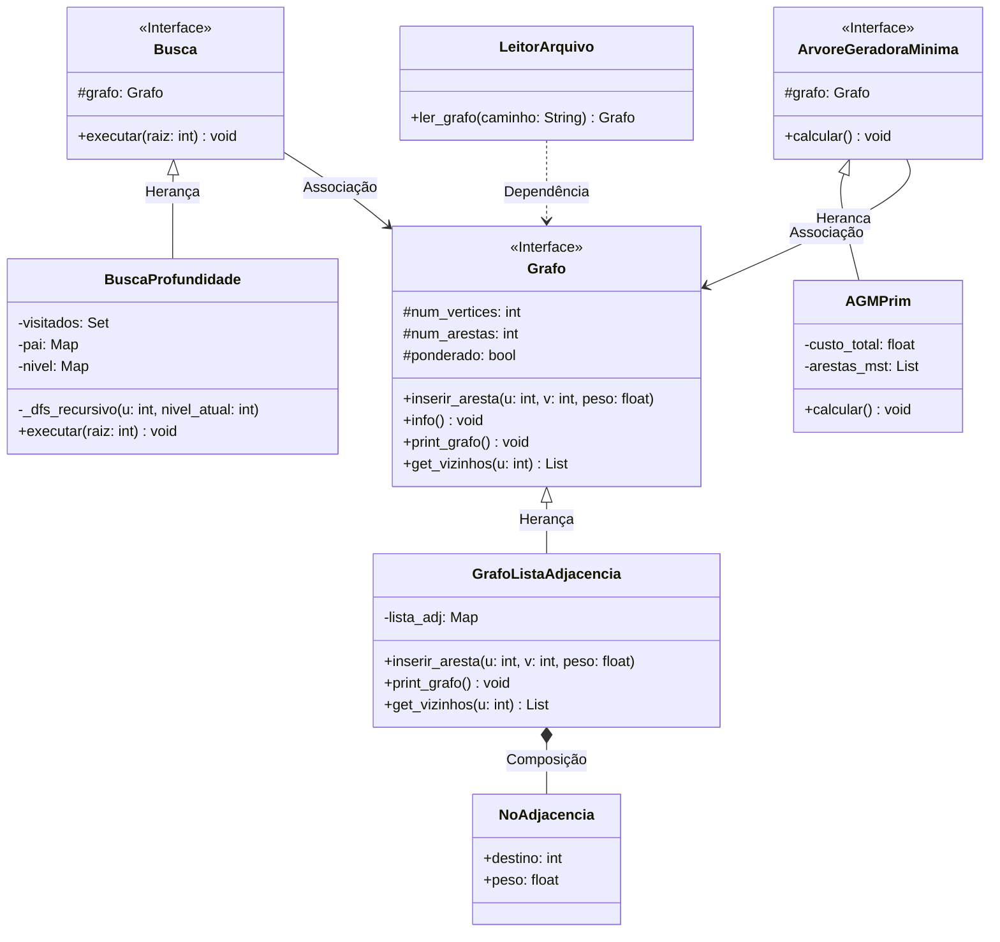

# Sistema de Algoritmos em Grafos

Trabalho de implementação de Estrutura de Dados e Teoria dos Grafos. O objetivo deste projeto é a implementação de algoritmos clássicos de grafos utilizando Orientação a Objetos em Python.

## 🛠️ O que foi implementado
- **Estrutura de Dados:** Lista de Adjacência (através de Dicionários e classes próprias para os nós).
- **Entrada de Dados:** Leitura padronizada via arquivo `.txt`.
- **Busca em Grafos:** Busca em Profundidade (DFS - Depth-First Search).
- **Árvore Geradora Mínima:** Algoritmo de Prim utilizando Fila de Prioridade (Min-Heap).

## 🚀 Como Executar

1. Certifique-se de ter o Python instalado em sua máquina.
2. Clone o repositório ou baixe os arquivos.
3. No terminal, execute o arquivo principal:
```bash
python main.py
```
4. Informe o caminho do arquivo de teste (ex: `grafo_teste.txt`) quando solicitado.

## 🏗️ Arquitetura e Modularização (Diagrama de Classes)

O projeto foi construído respeitando princípios de Orientação a Objetos, garantindo encapsulamento, herança e injeção de dependência para facilitar futuras extensões.

